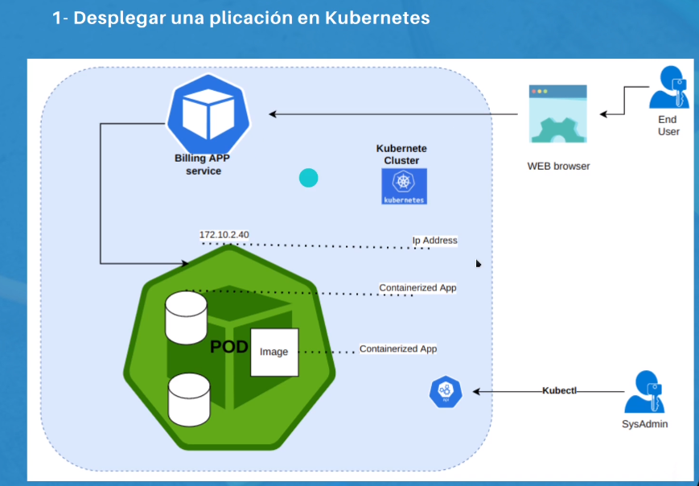
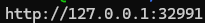
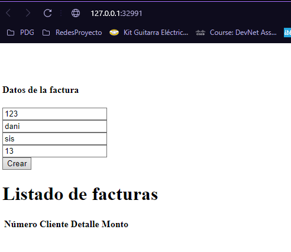

# Deploying Billing Application on Kubernetes

<p align="center">
  
</p>

This repository contains instructions for deploying a billing application on a Kubernetes cluster using Minikube.

## Introduction
The billing application is a containerized application running on a Kubernetes cluster. It utilizes various Kubernetes objects such as pods and services to manage the deployment and access to the application.

## Prerequisites
Before getting started, make sure you have the following requirements installed:
- [Minikube](https://minikube.sigs.k8s.io/docs/start/)
- [kubectl](https://k8s-docs.netlify.app/en/docs/tasks/tools/install-kubectl/)
- [Docker](https://docs.docker.com/engine/install/ubuntu/)
- [Docker Compose](https://docs.docker.com/compose/install/)

## Steps to Deploy the Application
Follow these steps to deploy the billing application on your Kubernetes cluster:

1. **Create a Pod**: Run the following command to create a pod with the billing application container:
    ```bash
    kubectl run kbillingapp --image=sotobotero/udemy-devops:0.0.1 --port=80
    ```

2. **Verify Pods**: Use the following command to verify that the pod has been created successfully:
    ```bash
    kubectl get pods
    ```

3. **Describe the Pod**: Get details about the newly created pod with the following command:
    ```bash
    kubectl describe pod kbillingapp
    ```

4. **Expose the Service**: Create a service to expose the pod and make the application accessible from outside the cluster. Use the following command:
    ```bash
    kubectl expose pod kbillingapp --type=LoadBalancer --port=8080 --target-port=80
    ```


5. **Verify Services**: Verify that the service has been created successfully with the following command:
    ```bash
    kubectl get services
    ```

6. **Describe the Service**: Get details about the newly created service with the following command:
    ```bash
    kubectl describe service kbillingapp
    ```

7. **Get the Service URL**: Use Minikube to get the URL of the service and access the application. Run the following command:
    ```bash
    minikube service --url kbillingapp
    ```

<p align="center">
  
</p>
<p align="center">
  
</p>


