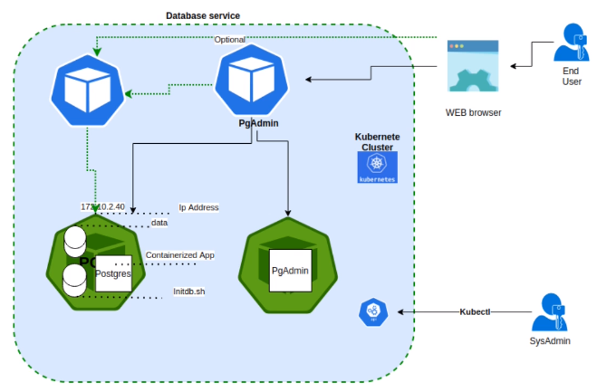
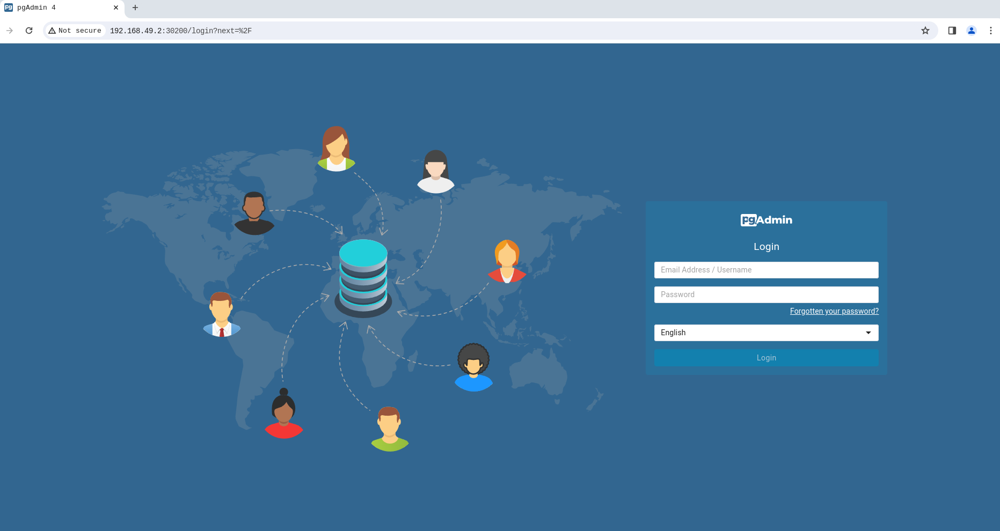
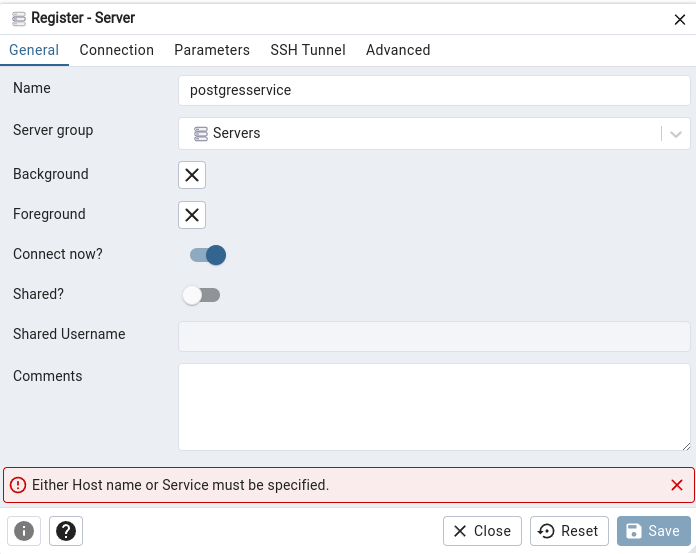
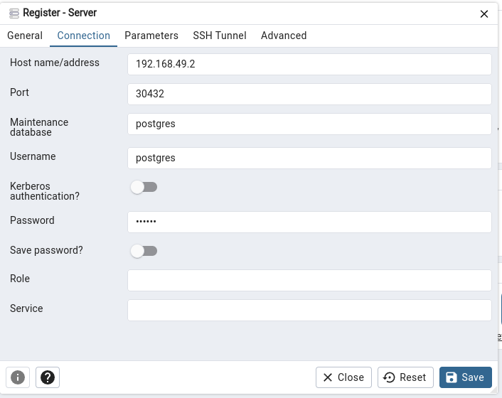
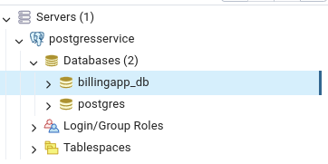
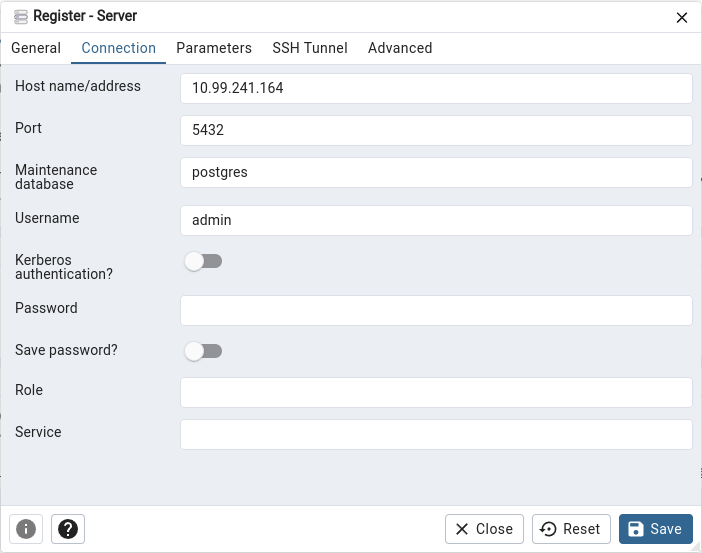
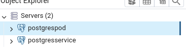

# Kubernetes Deployment: PostgreSQL Database with pgAdmin Administration Interface

<p align="center">
  
</p>

## Introduction

This repository contains configuration files to deploy a service consisting of a PostgreSQL database engine and a web admin. Two pods will be deployed, one containing pgAdmin and the other containing the PostgreSQL database with volumes for data persistence and initialization scripts. Additionally, a service will be set up to allow users to access both the web admin and the database engine directly.

## Process

1. **Creating Configuration Files:**
    - Create a YAML file to store database credentials.
    - Generate base64-encoded credentials for the PostgreSQL user and password.

2. **Creating YAML Files:**
    - **Configmap-postgres-initdb.yaml:** Defines the initialization script for the PostgreSQL database.
    - **Deployment-pgadmin.yaml:** Deploys the pgAdmin pod.
    - **Deployment-postgres.yaml:** Deploys the PostgreSQL pod with data persistence.
    - **Persistence-volume-claim.yaml:** Defines the persistent storage request for PostgreSQL.
    - **Persistence-volume.yaml:** Defines the persistent volume for PostgreSQL.
    - **Secret-dev.yaml:** Stores sensitive environment variables for PostgreSQL.
    - **Secret-pgadmin.yaml:** Stores sensitive environment variables for pgAdmin.
    - **Service-pgadmin.yaml:** Defines the service for pgAdmin.
    - **Service-postgres.yaml:** Defines the service for PostgreSQL.

3. **Applying YAML Files:**
    ```
    kubectl apply -f ./
    ```

4. **Accessing the Service:**
    - Obtain the Minikube cluster IP: `minikube ip`
    - Access with the obtained IP plus port 30200 to reach pgAdmin.


    - Use the provided credentials to log in to pgAdmin.

<p align="center">
  
</p>


5. **Connecting to the Database Engine:**
    - Use the external IP of the cluster along with the postgres-service port to access the database engine.
    - Use the credentials defined in Secret-dev to log in.
    
<p align="center">
  
</p>

<p align="center">
  
</p>

<p align="center">
  
</p>
6. **Alternatively, Internal Connection with pgAdmin:**
    - Access with the service IP and its internal port for pgAdmin.
    - Use the credentials defined in Configmap-postgres-initdb to connect to the database.
    
<p align="center">
  
</p>

<p align="center">
  
</p>


